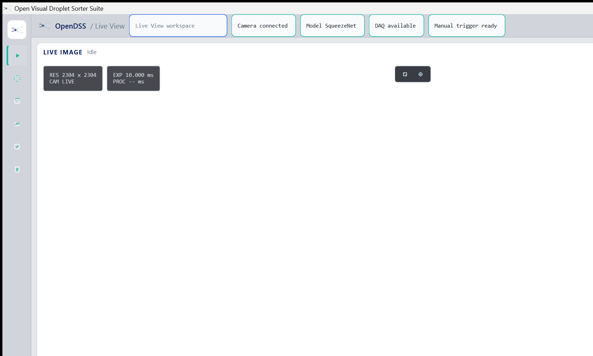
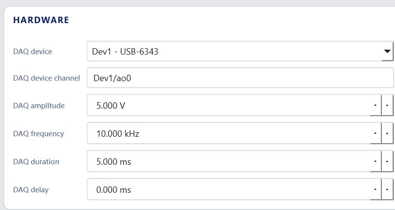
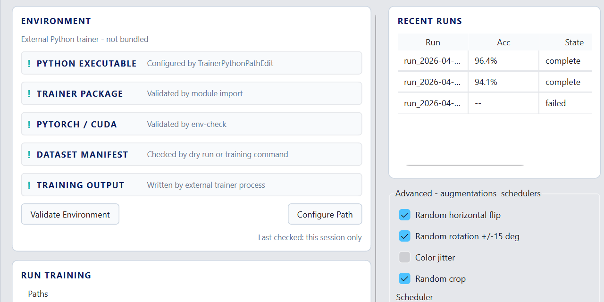

# OpenDSS

Open Visual Droplet Sorter for live camera inspection, ONNX-based event classification, and optional NI hardware triggering on Windows.

<p align="center">
  
</p>

Public Windows binary releases are distributed through [GitHub Releases](https://github.com/haeminjung12/OpenDSS_clean/releases/latest). Vendor drivers and Microsoft runtime installers are treated as user-installed prerequisites.

## What It Does

OpenDSS is a desktop application for running a droplet-sorting workflow from a Windows workstation. It combines live camera viewing, detector controls, model-backed inference, hardware settings, and optional DAQ triggering in one Qt-based interface.

It is designed for lab setups that use Hamamatsu camera hardware and may also use NI output hardware for trigger delivery.

## Key Features

- Live camera view with dedicated camera controls
- Detector and event-processing controls for real-time inspection workflows
- ONNX Runtime inference for model-backed classification
- Optional NI-DAQmx trigger output for hardware-integrated sorting setups
- Hardware settings workspace for camera and DAQ configuration
- Windows training helpers for preparing datasets and training updated models outside the desktop app

## Hardware Requirements

### Required

- Windows 10 or Windows 11
- A supported Hamamatsu camera installation path if you want to use live acquisition
- Hamamatsu DCAM-API / DCAM-SDK installed on the machine

### Optional

- NI DAQ hardware supported by NI-DAQmx for trigger output
- A trained ONNX model suitable for your droplet-classification workflow

## Downloads

### Application

- Public installer release: [GitHub Releases](https://github.com/haeminjung12/OpenDSS_clean/releases/latest)
- Release assets are distributed through GitHub Releases.
- The public installer does not bundle or run NI-DAQmx, Hamamatsu DCAM, or Microsoft Visual C++ Redistributable installers.

### Vendor Prerequisites

- Hamamatsu DCAM-API for Windows: [official download page](https://www.hamamatsu.com/jp/en/product/cameras/driver-software/dcam-api-for-windows.html)
- Hamamatsu DCAM-SDK4: [official product page](https://www.hamamatsu.com/all/en/product/cameras/software/driver-software/dcam-sdk4.html)
- NI-DAQmx Runtime / driver install guidance: [official NI article](https://knowledge.ni.com/KnowledgeArticleDetails?id=kA0VU0000003eH30AI&l=en-CA)
- Microsoft Visual C++ Redistributable x64: [latest supported downloads](https://learn.microsoft.com/en-us/cpp/windows/latest-supported-vc-redist?view=msvc-170)
- Qt for source builds: [Qt Online Installer](https://www.qt.io/development/download-open-source)
- ONNX Runtime for source builds: [installation guide](https://onnxruntime.ai/docs/install/)

## Quick Start

1. Build from source, or use the public installer after it is posted to [GitHub Releases](https://github.com/haeminjung12/OpenDSS_clean/releases/latest).
2. Install Hamamatsu DCAM-API before connecting a supported camera.
3. Install Microsoft Visual C++ Redistributable x64 if it is not already present on the target machine.
4. Install NI-DAQmx only if your setup needs NI-based trigger output.
5. Launch OpenDSS and configure camera, detector, model, and hardware settings for your workflow.

## Screenshots





## Build From Source

OpenDSS is a Windows C++/Qt project built with CMake.

### Requirements

- CMake 3.19 or newer
- Visual Studio with the MSVC x64 toolchain
- Qt 6 Widgets
- OpenCV
- ONNX Runtime
- Hamamatsu DCAM SDK
- NI-DAQmx headers and libraries only if you want NI support enabled

### Configure And Build

```powershell
cmake -S app/runtime -B build-opendss-release `
  -G "Visual Studio 17 2022" -A x64 `
  -D CMAKE_PREFIX_PATH="C:\Qt\6.10.1\msvc2022_64" `
  -D ONNXRUNTIME_DIR="C:\onnxruntime-gpu" `
  -D ENABLE_NIDAQMX=OFF `
  -D BUILD_QT_GUI=ON

cmake --build build-opendss-release --config Release --target desktop_app
```

To enable NI-trigger support, configure with `-D ENABLE_NIDAQMX=ON` and provide valid NI-DAQmx include/library paths.

### Optional Model Training Helpers

The installer and portable package include trainer helper scripts under `training/python`, but they do not bundle Python, PyTorch, CUDA, datasets, checkpoints, or a virtual environment. Create a user-managed environment before using the trainer.

Recommended CPU setup from `training/python`:

```powershell
.\scripts\windows\create-training-venv.ps1 -Python py -VenvPath "$env:LOCALAPPDATA\OpenVisualDropletSorter\training-venv"
.\scripts\windows\install-training-cpu.ps1 -VenvPath "$env:LOCALAPPDATA\OpenVisualDropletSorter\training-venv"
.\scripts\windows\verify-training-env.ps1 -VenvPath "$env:LOCALAPPDATA\OpenVisualDropletSorter\training-venv" -RequireTraining
```

GPU setup is optional and uses one of the CUDA-specific install wrappers in `training/python/scripts/windows`. A full instruction site with step-by-step installation, operation, trainer, and troubleshooting guidance is planned separately.

## License

- [LICENSE](LICENSE)
- [Third-Party Notices](THIRD_PARTY_NOTICES.md)
